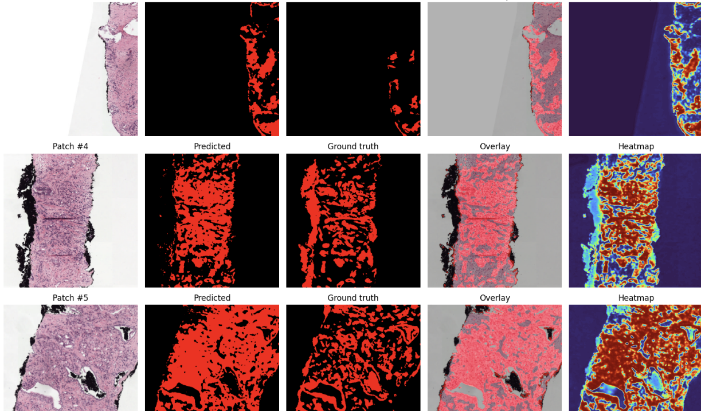

# PANDA Prostate Tumor Segmentation 
## Results 

##
- **Dataset:** [PANDA (Prostate cANcer graDe Assessment)](https://www.kaggle.com/competitions/prostate-cancer-grade-assessment)  
- **Goal:** segment **cancer** pixels vs non-cancer  
- **Core functions to look at:**
  - `find_one_tumor_example()` – picks one slide that actually has tumor
  - `tumor_bool_from_gray(mask_gray)` – converts raw mask labels → **binary cancer mask**
  - `tissue_mask_rgb(img_rgb)` – rough tissue detector for patch filtering (not labels)
  - **Patching:** code block where we tile with `slide.read_region(...)` and aligned `mask.read_region(...)`
  - **Dataset:** `class PatchSet(Dataset)` – loads saved patches for training
  - **Training:** `run_epoch(...)` – one pass over dataloader
  - **Inference:** we build a `pred_canvas` (probability map) over the slide
  - **Heatmap & Quant:** `slide_quantification(...)` (or the inline quant code) does area/percent

---

## Folder layout (Kaggle Working)
```
/kaggle/working/
  aria_seg_L0/               # or simple_demo/, depends which snippet you ran
    <SLIDE_ID>/
      img/                   # saved image patches (PNG)
      msk/                   # saved mask patches (PNG, binary cancer mask)
      train.csv              # manifest for training
      val.csv                # manifest for validation
```
Patches names contains coords like `SID_x1234_y5678.png` so its easy to trace back.

---

## 1) Dataset & assumptions
- We use **`train_images/`** and **`train_label_masks/`** from PANDA.  
- Masks differ by provider. Our helper **`tumor_bool_from_gray`** maps them to **binary cancer**:
  - Radboud: tumor classes = **{3,4,5}**
  - Karolinska: tumor class = **2**  
Everything else (0,1,2 benign etc.) becomes non-cancer.

> If your sample looks all green before, it was benign class being visualized. Binary mapping fixes that.

---

## 2) Zoomed‑out slide + mask
We first pick a slide with tumor via **`find_one_tumor_example()`**, then:  
- `slide.get_thumbnail(...)` to show the WSI quickly  
- `mask.get_thumbnail(...)` with the same size, convert to numpy (`mask_gray`)  
- Overlay for sanity

This makes sure image↔mask alignment is right before we go deeper.

---

## 3) Patching (512×512)
We read **aligned tiles** at a chosen **pyramid level** using:
- `slide.read_region((x0, y0), LEVEL, (PATCH_SIZE, PATCH_SIZE))`
- `mask.read_region((mx0, my0), LEVEL_M, (PATCH_SIZE, PATCH_SIZE))`

Coordinates are mapped with:
- `rx, ry = W0_m/W0_s, H0_m/H0_s` (ratio slide L0 to mask L0)  
So mask patch lines up with image patch.  
We store PNGs and a **manifest CSV** for training/val.

> Tissue filter uses `tissue_mask_rgb(...)`. It **only** avoids glass/blank, it’s not a labeler.

---

## 4) Training 
- Model: **DeepLabV3-ResNet50** (binary head)  
- Loss: **BCE + Dice** (good for class imbalance)  
- Data: `PatchSet` yields `(image, mask)` tensors in `[0,1]`  
- Loop: `run_epoch(dataloader, train=True/False)` prints total loss + approx Dice

---

## 5) Inference → Probability map → Heatmap
- We sweep the slide grid again and call `model(tile)["out"]`  
- Accumulate into `pred_canvas` (probabilities ∈ [0,1])  
- **Heatmap** is just a colormap over probabilities (e.g., JET).  
- **Threshold**: start at 0.5, but better pick it from validation (we also provide a helper for threshold/F1 search).

---

## 6) Tumor quantification
From `pred_canvas`:
- **Binary prediction** = `pred > THRESH`
- **Tissue mask** = `tissue_mask_rgb(...)` (so glass isn’t counted)
- **Tumor burden (% of tissue)** = tumor_pixels / tissue_pixels × 100
- If slide properties have `openslide.mpp-x/y`, we compute **tumor area mm²**.  
- Optionally do small-object removal and hole-filling to make counts realistic.

Function: **`slide_quantification(pred_canvas, slide, level_eval, thr=BEST_T)`** returns a dict with:
```
{ tumor_px, tissue_px, tumor_percent_of_tissue, tumor_mm2, tissue_mm2, num_regions, mask_clean }
```

---

## 7) Patch‑wise views
For quick QA we show rows of 3–5 panels:
- Original **image patch**
- **Predicted mask** (binary)
- **Overlay** (image + red mask)
- **Ground truth** patch
- **Heatmap** (per‑patch probabilities)

This helps to eyeball false positives/negatives right away.

---

## 8) Slide‑level grading with CNN+MIL
When you want **ISUP grade** or simple **cancer present/absent** per slide (no pixel masks needed):  
- Use your heatmap to pick **K tumor‑likely patches**  
- Extract features with a CNN and combine via **Attention MIL** (class `MILNet`)  
- Function points:
  - `select_tile_coords_for_slide(...)` – choose top‑K coords
  - `read_bag(...)` – read a bag of K patches
  - `MILNet.forward(bag)` – returns `(logits, attention_weights, feats)`

**Segmentation + MIL** combo works great: segmentation finds “where”, MIL decides slide label.

